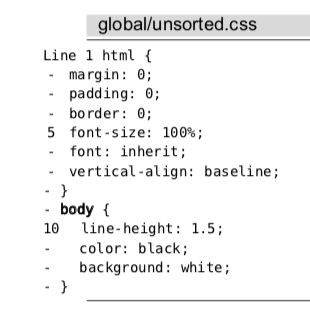
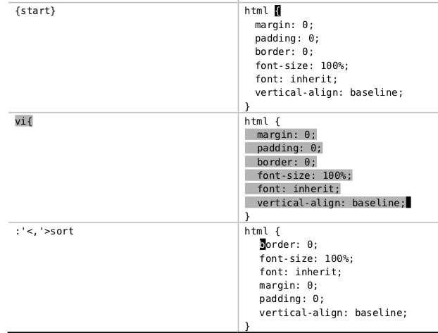

# 技巧100: 将 CSS 文件中所有规则的属性按照字母排序

### 例子：将 CSS 文件中所有规则的属性按照字母排序

> 

#### 解决方案1：每一个`{}`子块执行一次
先可视模式选中`{}`内的内容，然后调用vim内置的sort函数：
> 
1. 对于其他的子块，重复执行即可

#### 解决方案2：使用global命令排序

执行`:g/{/ .+1,/}/-1 sort`即可

1. 该命令分为`:g`,`/{/`,` .+1,/}/-1 sort`三部分，分别表示使用global命令、查找的是`{`这个符号，以及对匹配的位置使用的Ex命令
2. `.+1,/}/-1 sort`是执行的Ex命令：
    1. `.`表示的是当前行，`.+1`表示的是下一行
    2. `/}/`表示的是后面第一个`}`所在的行, `/}/-1`表示后面第一个`}`所在的下一行
    3. 该命令表示从`.+1`行到`/}/-1`行执行`sort`命令
    
### 例子：对`{}`内包含的每一行向右缩进

执行`:g/{/ .+1,/}/—1 >`即可

> `:>`命令每次执行会有提示（`:sort`命令不会有提示），所以可以先执行`:silent`取消提示信息

|上一篇|下一篇|
|:---|---:|
|[技巧99: 将 TODO 项收集至寄存器](tip99.md)|[技巧101: 结识ctags](../../part6_tools/chapter16_ctags/tip101.md)|
