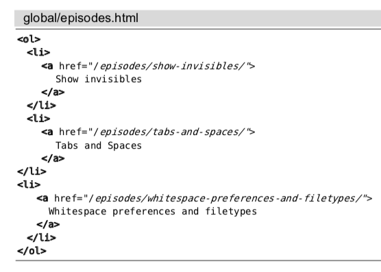

# 技巧98: 删除所有包含模式的文本行 
> 介绍`:global`命令和`:delete`命令复合使用

### 例子: 删除html中的标签，只保留文本
> 

执行2条命令即可：`/\v\<\/?\w+>`,`:g//d`

1. 第一条命令匹配所有的html tag
2. 第二条命令对所有的匹配进行删除操作(`d`)

`:v/href/d`表示删除所有不包含`href`的文本行，其中的`:v`表示`:vglobal`

> `grep`命令的来源
>> `:g/re/p` g表示全局执行；re表示 regular expression；p表示print

|上一篇|下一篇|
|:---|---:|
|[技巧97: 结识 global 命令](tip97.md)|[技巧99: 将 TODO 项收集至寄存器](tip99.md)|
