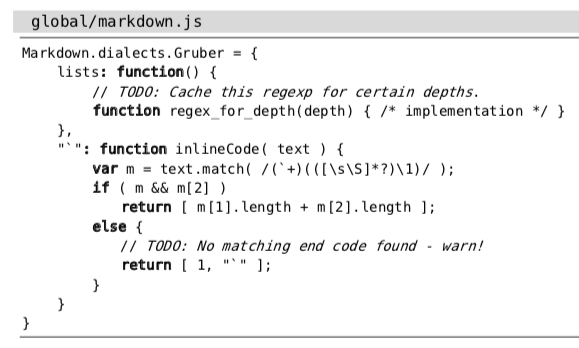

# 技巧99: 将 TODO 项收集至寄存器
> `:global`和`:yank`结合可以把匹配的文本存到寄存器中

### 例子：收集代码中的`TODO`项

> 

操作步骤：
```angular2html
// 将寄存器a的内容清空
qaq
// 查看一下当前寄存器a的内容
:reg a
// 将包含 TODO 注释的行复制到此寄存器; A表示将匹配的结果附加到寄存器a后，而不是每次附加的时候清空寄存器a的内容
:g/TODO/yank A
// 查看一下当前寄存器a的内容
:reg a
// 再打开一个新的缓冲区
// 在新的缓冲区中执行下面指令，将寄存器a中的内容复制到缓冲区
"ap
```

另一种解决方式：`:g/TODO/t$`
1. `:t` 的用法见[技巧29](../../part1_pattern/chapter5_ex_mode/tip29.md),，表示**复制到**，`:t$`表示**复制到最后一行**
2. 此条命令把所有含有**TODO**的行提取出来放到文本的最后


|上一篇|下一篇|
|:---|---:|
|[技巧98: 删除所有包含模式的文本行 ](tip98.md)|[技巧100: 将 CSS 文件中所有规则的属性按照字母排序](tip100.md)|
