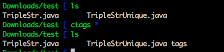
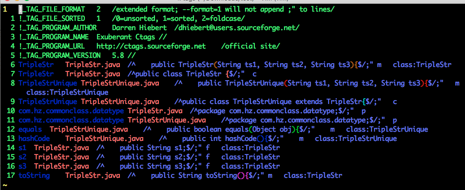

# 技巧101: 结识ctags 
> 介绍安装tags、ctags生成的文件分析

### 安装 ctags

```angular2html
// ubuntu:
sudo apt-get install exuberant-ctags
// OSX:
brew install ctags
// 检查ctags是否安装完毕：
ctags --help
```

### 例子：分析ctags生成的标签的文件

1. 执行下述命令：
```angular2html
ls
ctags *
ls
```
> 

2. vim查看一下生成的`tags`标签文件：
> 

> 1. 标签文件的前几行为元数据; 后面每行为关键字、文件名、关键字在源码中的位置这3项构成
>> 1. 关键字按照字母序排列，vim可以通过二分查找定位关键字
> 2. ctags使用模式定位关键字，而不是行号
>> 1. 优点在于避免添加文本导致的关键字位置错误
> 3. 关键字`c`表示类，`f`表示函数

|上一篇|下一篇|
|:---|---:|
|[技巧100: 将 CSS 文件中所有规则的属性按照字母排序](../../part5_pattern/chapter15_global_cmd/tip100.md)|[技巧102: 配置 Vim 使用 ctags](tip102.md)|
