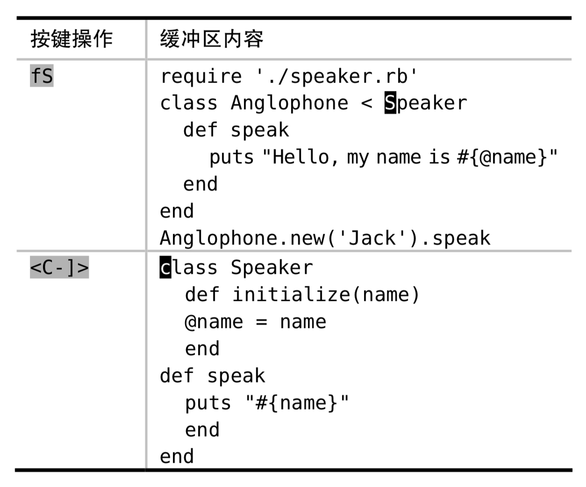
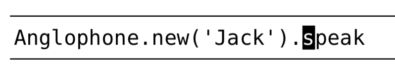
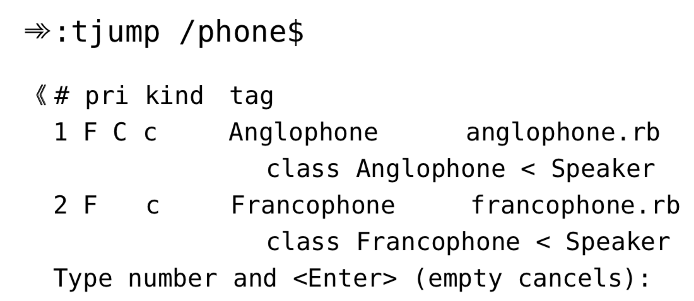

# 技巧 103: 使用 Vim 的标签跳转命令，浏览关键字的定义 
> ctags将代码中的关键字变成某种超链接，使用`<C-]>`和`g<C-]>`及相应的Ex命令跳转

### 例子：跳转到关键字的定义处
2个例子：
> 
> 

按照以上方式浏览代码库时，vim会维护一个标签历史列表，`<C-t>`充当【后退按钮】角色。
> 当例子2结束后：光标会从 Speaker 的定义处回到 Anglophone 的定义处；再按一次的话，光标会回到原位。

### 例子：从函数调用跳转到定义处
> 
对于前面的例子，知道Speaker和Anglophone都定义了speak函数，当光标在上述位置时，调用`<C-]>`命令，光标会自动跳到Anglophone的speak函数定义，而不是Speaker的speak函数。
> 这是因为vim优先查找缓冲区的标签，而Anglophone在更近的时间点搜索过

#### `g<C-]>`与`<C-]>`的区别
1. 如果当前关键字只有一处匹配，两者一样
2. 如果有多处匹配，前者会提供候选列表让我们选择
3. 对于不能选择的后者，当我们发现跳转错误了，使用`:tselect`调出标签匹配列表进行回溯；或者使用`:tnext`直接跳转到下一处匹配（也可以使用`:tprev`,`:tfirst`,`:tlast`进行切换）

#### 使用Ex命令进行跳转
1. `:tag {keyword}`与`:tjump {keyword}`等同于`<C-]>`与`g<C-]>`
2. 当vim为标签文件提供tab补全功能的时候，只需要输入`:tag Fran<Tab>`, Vim就会把内容扩展成完整的Francophone
3. `:tjump /phone$`会列出所有以`phone`结尾的关键字：
> 

|上一篇|下一篇|
|:---|---:|
|[技巧102: 配置Vim使用ctags](tip102.md)|[技巧 104: 不用离开 Vim 也能编译代码](../chapter17_compile/tip104.md)|
