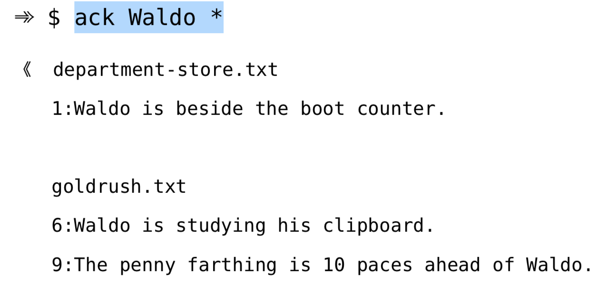

# 技巧 109 定制grep程序 
> 介绍如果配置`grepprg`与`grepformat`参数

1. `grepprg`选项负责制定所调用的shell程序
2. `grepformat`选项指示vim如何解析`:grep`命令的结果
> 1. 缺省的设置为：
>> `grepprg="grep -n $* /dev/null"`
>> `grepformat="%f:%l:%m,%f:%l%m,%f %l%m"`
>> 2. `%f`表示文件名，`%l`表示行号，`%m`表示匹配行的文本
>> 3. grepformat可以包含以逗号分隔的多组格式，不过vim将采用第一种格式匹配来自`:grep`的输出结果

### 例子：通过`:grep`调用ack
1. OSX中安装ack：`brew install ack`
2. ack的默认搜索结果会按照不同文件显示在不同的区块：
> 
> 使用`ack --nogroup Waldo *`参数可以得到类似grep的结果
3. `:set grepprg=ack\ --nogroup\ $*`可以把`:grep`实际使用的设置为ack
4. `set grepformat=%f:%l:%c:%m`设置打印格式
> `%c`表示列号

|上一篇|下一篇|
|:---|---:|
|[技巧108 不必离开 Vim 也能调用 grep ](tip108.md)|[技巧 110 使用 Vim 内部的 Grep](tip110.md)|
