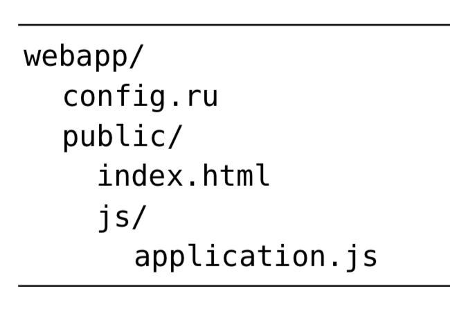
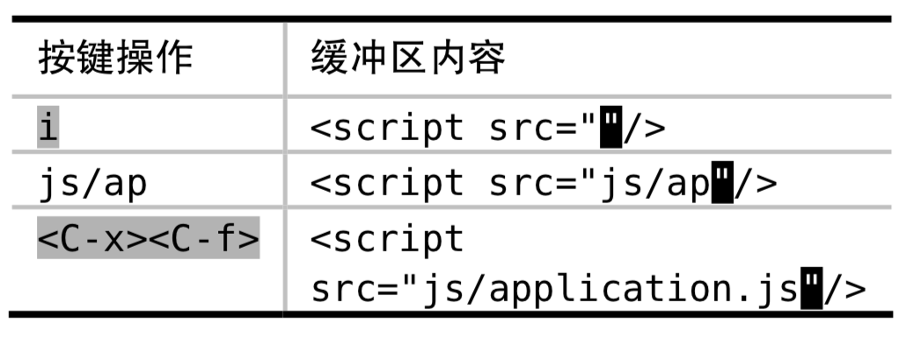

# 技巧 116 自动补全文件名 
> shell中可以使用`<Tab>`来自动补全路径中的目录和文件名；Vim中也有类似的操作(`<C-x><C-f>`)

#### `<C-x><C-f>`自动补全文件名

1. 注意vim维护的是当前的工作目录，而不是当前编辑的缓冲区文件所在的目录

### 例子：自动补全引用的js文件
> 假设文件目录为：
> 
> 需要对正在编辑的文件的src的属性值填充为application.js

1. 如果当前在vim中执行`:pwd`返回的结果为`webapp`，则自动补全的内容为相对于webapp文件夹的路径；进而，如果我们恰恰又需要将结果变成`src="js/application.js"`，则需要切换工作目录：
> :cd public

2. 然后执行下面操作即可：
> 

3. 进行完操作后执行`:cd -`回到原来的工作目录

|上一篇|下一篇|
|:---|---:|
|[技巧 115 自动补全整行文本 ](tip115.md)|[技巧 117 根据上下文自动补全](tip117.md)|
