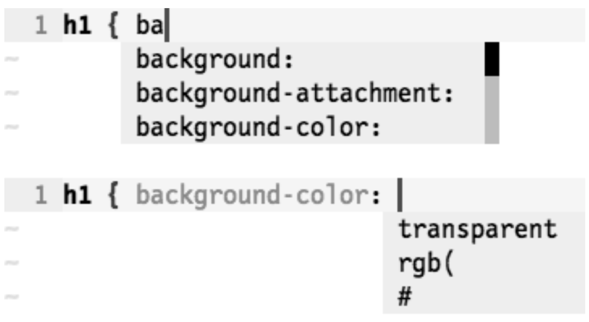

# 技巧 117 根据上下文自动补全
> 介绍全能补全功能

#### `<C-x><C-o>`触发全能补全功能
1. 该功能由专用的文件类型插件实现，需要加载以下配置：
```
set nocompatible
filetype plugin on
```
2. 还需要安装为所用语音实现全能补全功能的插件


### 例子：在css文件中使用全能补全的效果图
> 

0. 全能补全的效果如上图所示，当输入ba时，认为是CSS的属性的一部分；当输入完属性名之后，及时我们没有输入任何字，他也会发现是在填属性值，会提示不同于属性名的东西
1. CSS的静态语法特性决定了其非常适合全能补全


|上一篇|下一篇|
|:---|---:|
|[技巧 116 自动补全文件名 ](tip116.md)|[技巧 118 对你的工作进行拼写检查](../chapter20_spell_check/tip118.md)|
